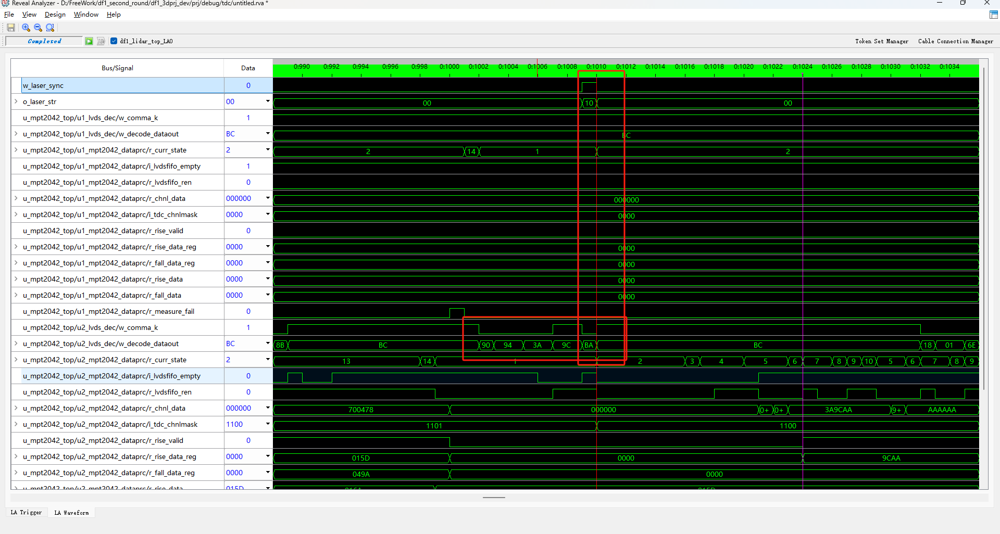
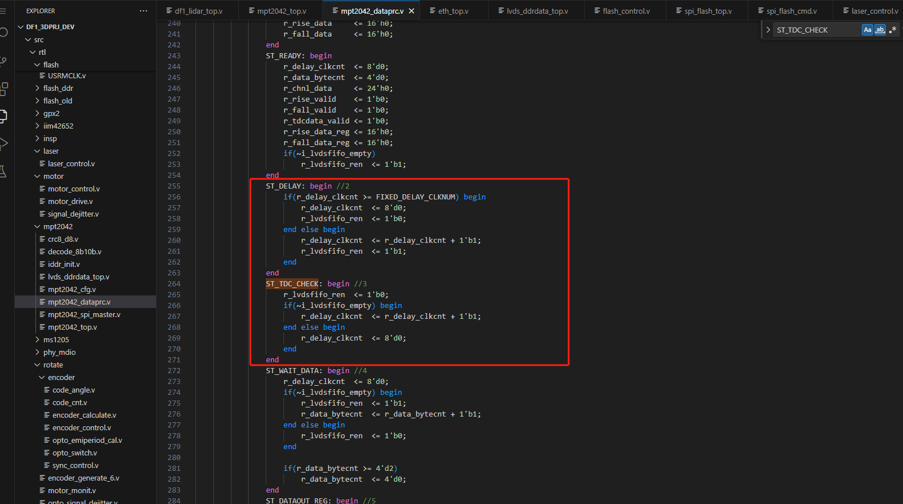

# 第二轮DF1调试记录

**pwm1对应motor1，结构中的上电机，码盘对应code1，频率71Hz**

**pwm2对应motor2，结构中的下电机，码盘对应code2，频率60Hz**

## 25/04/15 UDP广播及指令设置保存功能正常

1、在一轮协议的基础上修改协议部分，网络模块未作更改，广播正常发送

2、添加指令控制单个出光，debug测试指令设置正常

3、时序问题比较严重，-2.498ns左右

## 25/04/18 版本程序无时序报错

1、添加时序约束文件.sdc文件

2、修改时序报错中关于异步时钟处理的问题，ddr_round_robin的异步fifo asfifo_256x64设置为寄存器输出

3、修改udpcom_parameter_init模块中读取FIFO数据时多打一拍，因为异步FIFO设置为了寄存器输出

## 25/04/23 版本程序添加高压控制指令有的板子异常

1、因为无法正常加载雷达IP参数导致网络调试助手无法正常收到数据，进一步查询原因发现DDR读取失败

**2、因为DDR的demo工程读写正常，发现此现象与上一轮雷达调试DDR读取失败问题一样，都可以通过延长系统复位时间解决，表现出板级差异性。**

3、加长复位延时后程序功能正常

## 25/04/25 版本添加MPT2042

1、注意外部晶振需要拆除，使用内部晶振LVDS数据解析正常，后续注意主波需要翻转

2、数据处理需要修改

## 25/04/29 TDC数据处理

1、添加TDC数据处理模块，注意fifo模块的读出延时

2、可以输出前沿值和后沿值

## 25/05/06 两颗TDC芯片

1、配置两颗TDC芯片，发光逻辑配置

2、根据发光编号确认TDC通道数据

## 25/05/07 输出TDC数据

1、修改数据处理模块状态机结束的判断逻辑，在每次发光前10个时钟信号输出控制信号

2、输出TDC处理完成信号及前后沿值

## 25/05/09 电机调速合进去，标定数据量正常

1、电机控制逻辑更改

2、输出TDC处理完成信号及前后沿值

## 25/05/13 修改控速逻辑

电机调速参数调整

## 25/05/15 修改码盘分码

1、修改码盘分码逻辑

2、编写角度计算代码，debug测试正常

## 25/05/16 点云数据逻辑

1、修改连续取数逻辑代码

2、连续取数功能正常

3、修改雷达MAC地址

## 25/05/20 更换除法器

1、不适用除法器ip，使用verilog实现的除法器模块

## 25/05/21 标定取数指令设置点数

1、添加标定取数，通过指令设置输出点数

2、TDC寄存器阈值配置为259mv

## 25/05/22 修改TDC阈值，输出点云数据

1、TDC阈值设置为364mv

2、输出前沿值数据用于仿真

## 25/05/26 添加出光模式指令

1、8个发光点依次出光和单个发光点通过指令控制控制哪个点出光这两种模式通过指令可以进行切换

2、两种模式的出光频率都是800K

## 25/05/29 修改TDC模块

1、测试发现整机转动时有些点的前沿值异常，存在在下次出光信号到来时，上一次出光产生的lvds数据又来了一帧，这种情况会导致数据解析错误

2、修改部分代码如下，只修改此模块，部分修改未贴出图片